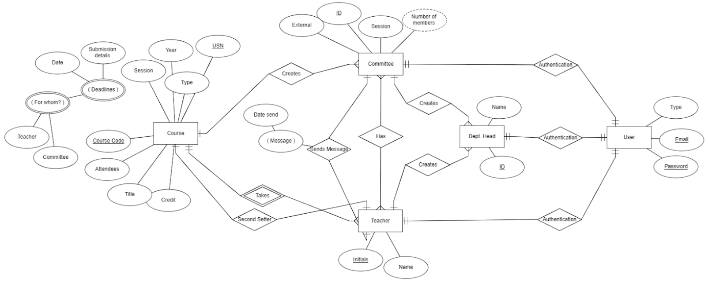
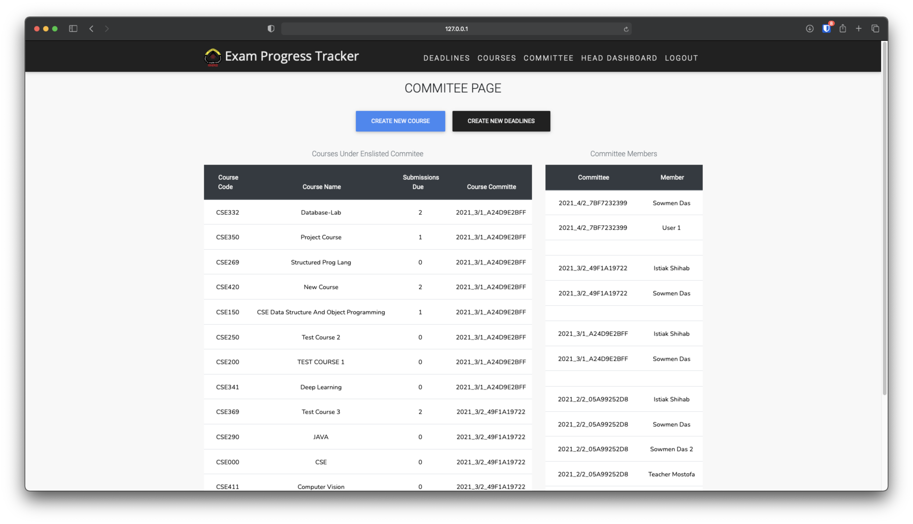
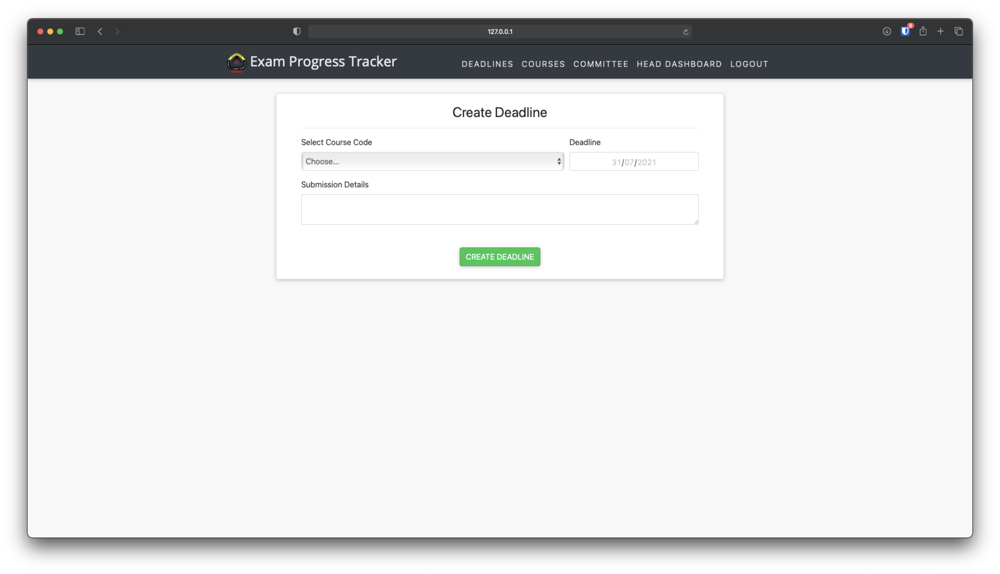
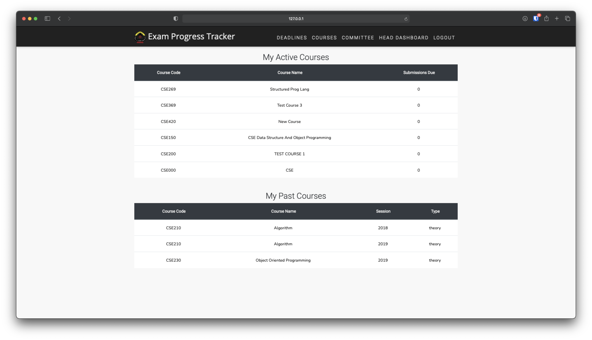
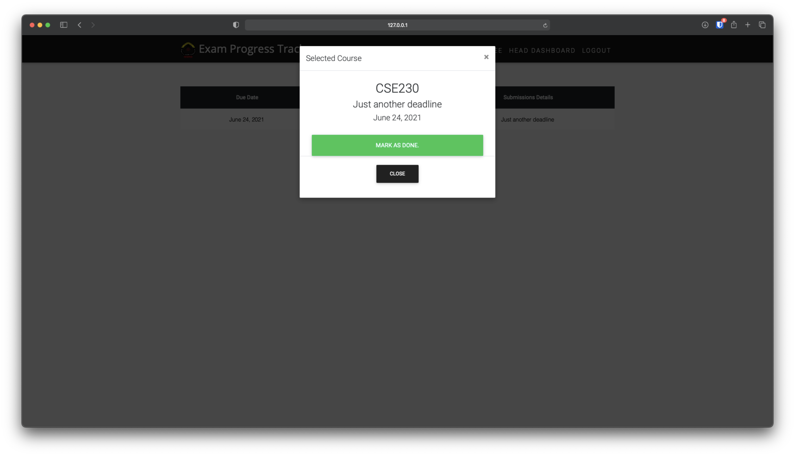

# Exam-Progress-Tracker-G30

## Description

This project tries to solve the issue of communication gap between department exam controllers and department heads and assigned teacher about Course and different objectives of that course. It introduces a very handy and simple structure to keep tabs on different objectives on different level.

We have used standard Django Framework, Some JQueries and a touch of Material Bootstrap to make the whole thing.

## ER Diagram

This is the Database ER Diagram followed to build up the project.



## Layout Design

These are some examples of the UIs we have built.






## How to start

Navigate to the Project Folder and use the following the commands to setup the environment:

```
python3 -m venv
source venv/bin/activate
pip install -r backend-requirements.txt
```

After activating the environment, Navigate to `Course-Progress-Tracker-v3` folder and use the following command to run the server:

```
python manage.py runserver
```

We have some default user setup to get it going. You can use the following user account to get sudo access:

```
sowmen@gmail.com
django1234
```

## Extra

You can also navigate to Scarpped-V2 to checkout our primary attempt at making this project real. We have used React and Django with JWT Authentication to make a much responsive website. We have some difficulties with the React part. But if you can use Axios properly, the rest of the hard work is pretty much done.
